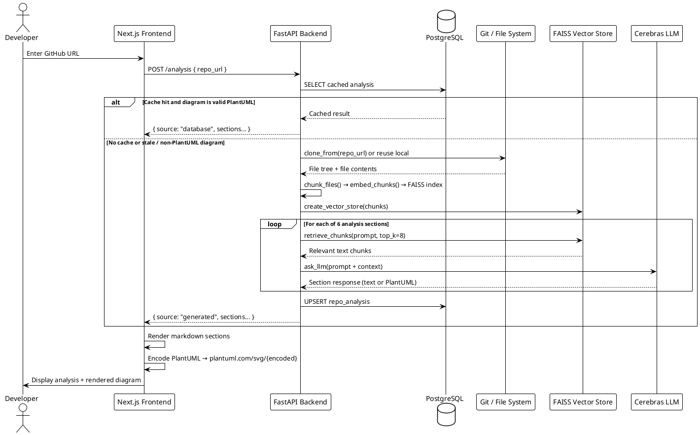
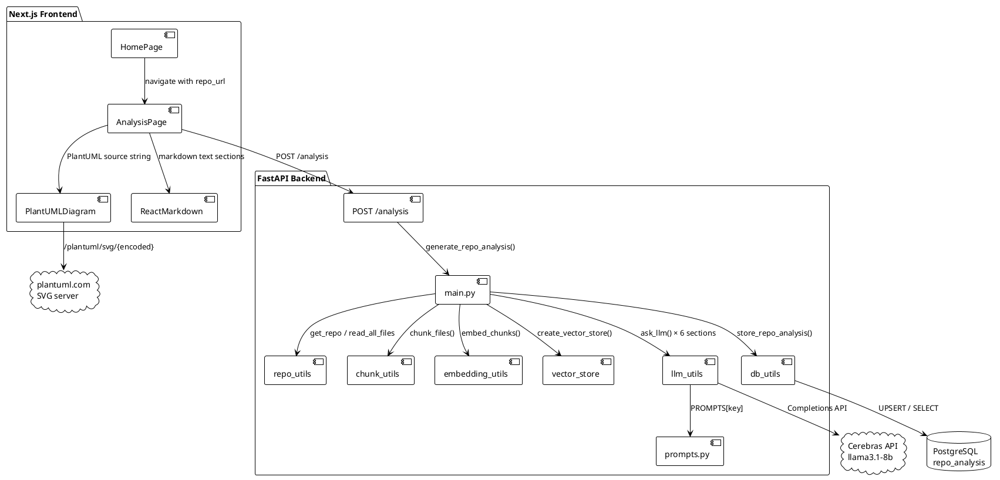
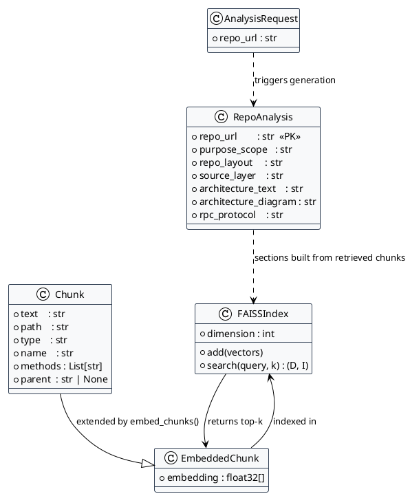

# GitHub Chat Codebase

> Paste any GitHub URL and get instant, AI-generated architecture docs — purpose summary, source layer breakdown, component diagrams, and API protocol analysis.

---

## Table of Contents

- [Tech Stack](#tech-stack)
- [Architecture](#architecture)
  - [System Flow](#system-flow)
  - [Component Overview](#component-overview)
  - [Entity / Class Model](#entity--class-model)
- [Repository Layout](#repository-layout)
- [Quick Start](#quick-start)
- [LLM-Oriented Guide](#llm-oriented-guide)

---

## Tech Stack

| Layer | Technology |
|---|---|
| Frontend | Next.js 16, React 19, TypeScript |
| Styling | Tailwind CSS v4 |
| Backend API | Python 3, FastAPI |
| LLM Inference | Cerebras Cloud SDK (`llama3.1-8b`) |
| Embeddings | `sentence-transformers` (BAAI/bge-small-en-v1.5) |
| Vector Store | FAISS (IndexFlatL2) |
| Database | PostgreSQL (psycopg2) |
| Repo Access | GitPython |
| Diagram Rendering | PlantUML (plantuml.com server, encoded via browser `CompressionStream`) |

---

## Architecture

All diagrams below are written in PlantUML. You can paste the source into [plantuml.com/plantuml](https://www.plantuml.com/plantuml) to render them.

### System Flow



### Component Overview



### Entity / Class Model



---

## Repository Layout

```
github-chat-codebase/
├── backend/                        # Python analysis engine
│   ├── api.py                      # FastAPI app + /analysis endpoint
│   ├── main.py                     # Orchestration: repo → chunks → embed → LLM → DB
│   ├── repo_utils.py               # Clone/open Git repos, read files
│   ├── chunk_utils.py              # AST-aware + fallback char-based chunking
│   ├── embedding_utils.py          # SentenceTransformer encode + FAISS retrieve
│   ├── vector_store.py             # FAISS IndexFlatL2 creation
│   ├── llm_utils.py                # Cerebras completions with retry
│   ├── prompts.py                  # Section prompts (PlantUML diagram prompt included)
│   └── db_utils.py                 # PostgreSQL upsert / select
│
├── frontend/                       # Next.js 16 UI
│   └── app/
│       ├── page.tsx                # Home route
│       ├── analysis/page.tsx       # Analysis view (PlantUML renderer, markdown)
│       ├── components/
│       │   ├── HomePage.tsx        # URL input + hero section
│       │   └── HeaderBar.tsx       # Global header
│       └── globals.css             # Design tokens + component styles
│
└── backend/temp_dir/               # Cloned repos cached locally
    └── AI_Based_Application_Tracker/   # Sample nested full-stack app (Node + React)
```

---

## Quick Start

### Python Backend

```bash
cd backend
python -m venv .venv
# Windows:
.venv\Scripts\activate
# macOS/Linux:
source .venv/bin/activate

pip install -r requirements.txt
uvicorn api:app --reload --port 8000
```

### Next.js Frontend

```bash
cd frontend
npm install
npm run dev
# open http://localhost:3000
```

Set `NEXT_PUBLIC_ANALYSIS_API_URL` in a `.env.local` file if the backend runs on a different port:

```
NEXT_PUBLIC_ANALYSIS_API_URL=http://localhost:8000/analysis
```

### Database Setup (PostgreSQL)

```sql
CREATE DATABASE repo_analysis_db;

\c repo_analysis_db

CREATE TABLE repo_analysis (
  repo_url          TEXT PRIMARY KEY,
  purpose_scope     TEXT,
  repo_layout       TEXT,
  source_layer      TEXT,
  architecture_text TEXT,
  architecture_diagram TEXT,
  rpc_protocol      TEXT
);
```

---

## LLM-Oriented Guide

Use this section when prompting an LLM so it can navigate the repo correctly.

### Scope and Boundaries
- Exclude all `node_modules` folders.
- Exclude Python virtual environments such as `.venv`.
- Treat `backend/temp_dir/AI_Based_Application_Tracker/` as a nested, standalone app with its own client and server.

### Key Entry Points
- `backend/api.py` — FastAPI application; start here for request handling.
- `backend/main.py` — Core orchestration logic; `generate_repo_analysis()`.
- `frontend/app/analysis/page.tsx` — Analysis UI; PlantUML rendering happens here.
- `frontend/app/page.tsx` — Landing page route.
- `backend/prompts.py` — All LLM prompts; edit here to change output format or style.

### Suggested Prompt

> "Analyze this monorepo. Ignore all `node_modules`, `.venv`, build artifacts, and lock files. Start with `backend/api.py`, `backend/main.py`, and `frontend/app/analysis/page.tsx`. Summarize the architecture, key data flow, and likely extension points."

